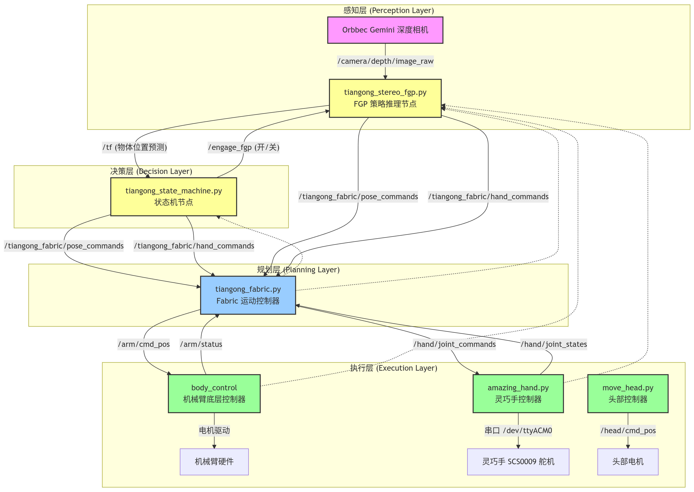
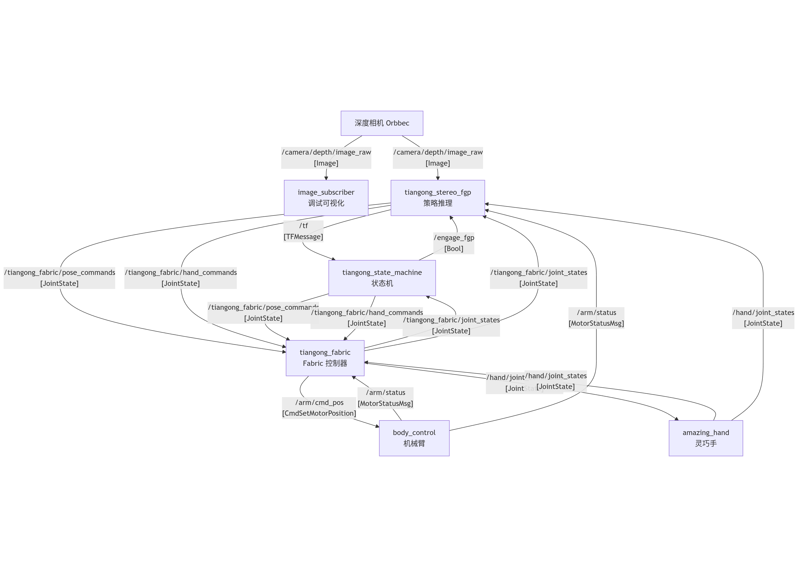

# Tiangong 部署脚本

本目录包含用于 Tiangong 机器人实际部署的 ROS 2 节点脚本，主要实现机械臂和灵巧手的控制、视觉感知和策略推理功能。

## 📁 文件结构

```
tiangong_deployment_scripts/
├── tiangong_fabric.py          # Fabric 运动控制器节点（核心控制器）
├── tiangong_stereo_fgp.py      # FGP 策略推理节点（深度视觉策略）
├── tiangong_state_machine.py   # 状态机节点（任务流程控制）
├── tiangong_random_targets.py  # 随机目标测试节点
├── amazing_hand.py             # 灵巧手硬件控制器节点
├── dummy_amazing_hand.py       # 灵巧手模拟节点（调试用）
├── image_subscriber.py         # 深度图像订阅和可视化节点
├── move_head.py                # 头部运动控制节点
├── policy_inference_stereo.py  # 策略推理模块（被其他节点调用）
└── README.md                   # 本文档
```

## 🔧 节点功能说明

### 1. tiangong_fabric.py - Fabric 运动控制器

**节点名称**: `tiangong_fabric`

**功能**: 实现基于 Fabric 的运动规划和控制，将末端位姿命令转换为关节空间控制命令。

**订阅话题**:
| 话题名称 | 消息类型 | 描述 |
|---------|---------|------|
| `/arm/status` | `MotorStatusMsg` | 机械臂关节状态反馈 |
| `/hand/joint_states` | `JointState` | 灵巧手关节状态反馈 |
| `/tiangong_fabric/pose_commands` | `JointState` | 末端位姿命令输入 |
| `/tiangong_fabric/hand_commands` | `JointState` | 灵巧手命令输入 |

**发布话题**:
| 话题名称 | 消息类型 | 描述 |
|---------|---------|------|
| `/arm/cmd_pos` | `CmdSetMotorPosition` | 机械臂关节位置命令 |
| `/hand/joint_commands` | `JointState` | 灵巧手关节命令 |
| `/tiangong_fabric/joint_states` | `JointState` | Fabric 状态反馈 |

---

### 2. tiangong_stereo_fgp.py - FGP 策略推理节点

**节点名称**: `dextrah_fgp`

**功能**: 基于深度图像的灵巧操作策略推理，使用 Transformer 模型处理视觉输入并输出末端位姿和灵巧手动作。

**订阅话题**:
| 话题名称 | 消息类型 | 描述 |
|---------|---------|------|
| `/camera/depth/image_raw` | `Image` | 深度相机图像 |
| `/arm/status` | `MotorStatusMsg` | 机械臂关节状态 |
| `/hand/joint_states` | `JointState` | 灵巧手关节状态 |
| `/tiangong_fabric/joint_states` | `JointState` | Fabric 状态反馈 |
| `/engage_fgp` | `Bool` | FGP 激活开关 |

**发布话题**:
| 话题名称 | 消息类型 | 描述 |
|---------|---------|------|
| `/tiangong_fabric/pose_commands` | `JointState` | 末端位姿命令 |
| `/tiangong_fabric/hand_commands` | `JointState` | 灵巧手命令 |
| `/tf` | `TFMessage` | 预测的物体位置 |

**模型配置**:
- 配置文件: `tasks/tiangong/agents/rl_games_ppo_mono_transformer.yaml`
- 检查点: `pretrained_ckpts_01_29/dextrah_student_60000_iters.pth`

---

### 3. tiangong_state_machine.py - 状态机节点

**节点名称**: `dextrah_state_machine`

**功能**: 管理抓取任务的状态流程，包括移动到目标、抓取、放置等状态转换。

**订阅话题**:
| 话题名称 | 消息类型 | 描述 |
|---------|---------|------|
| `/tf` | `TFMessage` | 物体位置（来自 FGP 预测） |
| `/tiangong_fabric/joint_states` | `JointState` | Fabric 状态反馈 |
| `/tiangong_fabric/hand_commands` | `JointState` | 灵巧手命令监听 |

**发布话题**:
| 话题名称 | 消息类型 | 描述 |
|---------|---------|------|
| `/engage_fgp` | `Bool` | FGP 激活开关 |
| `/tiangong_fabric/pose_commands` | `JointState` | 末端位姿命令 |
| `/tiangong_fabric/hand_commands` | `JointState` | 灵巧手命令 |

---

### 4. amazing_hand.py - 灵巧手硬件控制器

**节点名称**: `amazing_hand_controller`

**功能**: 通过串口与 SCS0009 舵机通信，实现灵巧手的底层控制。

**硬件接口**: `/dev/ttyACM0` (波特率: 1000000)

**订阅话题**:
| 话题名称 | 消息类型 | 描述 |
|---------|---------|------|
| `/hand/joint_commands` | `JointState` | 灵巧手关节命令 |

**发布话题**:
| 话题名称 | 消息类型 | 描述 |
|---------|---------|------|
| `/hand/joint_states` | `JointState` | 灵巧手关节状态反馈 |

**控制关节**:
- `Joint_A01_R`: 电机 ID 1, 2
- `Joint_B01_R`: 电机 ID 7, 8

---

### 5. dummy_amazing_hand.py - 灵巧手模拟节点

**节点名称**: `amazing_hand_controller`

**功能**: 模拟灵巧手控制器，用于无硬件环境下的调试。

**发布话题**:
| 话题名称 | 消息类型 | 描述 |
|---------|---------|------|
| `/hand/joint_states` | `JointState` | 模拟的灵巧手状态 |

---

### 6. image_subscriber.py - 深度图像可视化节点

**节点名称**: `image_subscriber`

**功能**: 订阅深度相机图像并进行实时可视化，用于调试和验证相机数据。

**订阅话题**:
| 话题名称 | 消息类型 | 描述 |
|---------|---------|------|
| `/camera/depth/image_raw` | `Image` | 深度相机图像 |

---

### 7. move_head.py - 头部控制节点

**节点名称**: `move_head_node`

**功能**: 控制机器人头部的 3 个电机位置, 固定头部位置

**发布话题**:
| 话题名称 | 消息类型 | 描述 |
|---------|---------|------|
| `/head/cmd_pos` | `CmdSetMotorPosition` | 头部电机位置命令 |

---

### 8. tiangong_random_targets.py - 随机目标测试

**节点名称**: `tiangong_random_commander`

**功能**: 生成随机的末端位姿和灵巧手目标，用于测试 Fabric 控制器。

**发布话题**:
| 话题名称 | 消息类型 | 描述 |
|---------|---------|------|
| `/tiangong_fabric/pose_commands` | `JointState` | 随机末端位姿命令 |
| `/tiangong_fabric/hand_commands` | `JointState` | 随机灵巧手命令 |

---

### 9. policy_inference_stereo.py - 策略推理模块

**类型**: Python 模块（非独立节点）

**功能**: 提供 `RLGamesPolicy` 类，封装强化学习策略模型的加载和推理功能。

**主要接口**:
```python
class RLGamesPolicy:
    def __init__(self, cfg_path, img_shape, num_proprio_obs, num_actions, ckpt_path, device)
    def reset_hidden_state(self)
    def infer(self, proprio_obs, img_obs) -> actions
```

---

## 🚀 启动顺序

### 完整部署（策略执行模式）

按以下顺序在不同终端中启动节点：

```bash
# 终端 1: 在nvidia orin中启动深度相机
cd ~/orbbec_ros2ws
source install/setup.bash
ros2 launch orbbec_camera gemini_330_series.launch.py depth_width:=640 depth_height:=480

# 终端2: 启动天工机器人关节控制器
cd ~/ros2_ws
sudo su
source install/setup.bash
ros2 launch body_control body.launch.py

# 终端 2: 启动灵巧手控制器
cd ~/DEXTRAH/dextrah_lab/tiangong_deployment_scripts
python3 amazing_hand.py

# 终端 3: 启动头部控制
cd ~/DEXTRAH/dextrah_lab/tiangong_deployment_scripts
python3 move_head.py

# 终端 4: 启动 Fabric 运动控制器
cd ~/DEXTRAH/dextrah_lab/tiangong_deployment_scripts
python3 tiangong_fabric.py

# 终端 5: 启动 FGP 策略推理节点
cd ~/DEXTRAH/dextrah_lab/tiangong_deployment_scripts
python3 tiangong_stereo_fgp.py

# 终端 6: 启动状态机
cd ~/DEXTRAH/dextrah_lab/tiangong_deployment_scripts
python3 tiangong_state_machine.py
```

### 图像调试

```bash
# 启动相机后，运行图像订阅节点查看深度图
python3 image_subscriber.py
```

---

## 📊 系统架构图

### 整体部署架构



### ROS 2 话题数据流



### 节点依赖关系

```
启动顺序 (从下到上):

    Level 4 (决策层)
    ┌─────────────────────────────────────────────────────────────────┐
    │  tiangong_state_machine.py    tiangong_stereo_fgp.py            │
    │         ↑                              ↑                        │
    └─────────┼──────────────────────────────┼────────────────────────┘
              │                              │
              │         依赖                  │
              │                              │
    Level 3 (规划层)                          │
    ┌─────────┼──────────────────────────────┼────────────────────────┐
    │         └──────────────────────────────┘                        │
    │                        ↑                                        │
    │              tiangong_fabric.py                                 │
    │                        ↑                                        │
    └────────────────────────┼────────────────────────────────────────┘
                             │
                             │         依赖
                             │
    Level 2 (执行层)          │
    ┌────────────────────────┼────────────────────────────────────────┐
    │         ┌──────────────┴───────────────┐                        │
    │         ↑                              ↑                        │
    │   body_control               amazing_hand.py / move_head.py     │
    │   (ros2 launch)                        ↑                        │
    └─────────┼──────────────────────────────┼────────────────────────┘
              │                              │
              │         依赖                  │
              │                              │
    Level 1 (感知层)                          │
    ┌─────────┼──────────────────────────────┼────────────────────────┐
    │         └──────────────────────────────┘                        │
    │                        ↑                                        │
    │              orbbec_camera (深度相机)                            │
    │                                                                 │
    └─────────────────────────────────────────────────────────────────┘

    ⚠️ 启动顺序: Level 1 → Level 2 → Level 3 → Level 4
```

---

## ⚙️ 配置参数

### 控制频率
- Fabric 控制器: **60 Hz**
- 灵巧手控制器: **60 Hz**
- FGP 策略推理: **60 Hz**

### 机械臂关节配置
- 控制关节 ID: `[21, 22, 23, 24, 25, 26, 27]` (arm-right 20 + id)
- 速度限制: `0.2 rad/s`
- 电流限制: `5.0 A`

### 灵巧手关节配置
- 控制关节: `["Joint_A01_R", "Joint_B01_R"]`
- 串口设备: `/dev/ttyACM0`
- 波特率: `1000000`

---

## 🔗 依赖项

### ROS 2 消息包
- `sensor_msgs`
- `geometry_msgs`
- `std_msgs`
- `tf2_msgs`
- `bodyctrl_msgs` (自定义消息包)

### Python 库
- `torch`
- `numpy`
- `opencv-python`
- `cv_bridge`
- `matplotlib`
- `yaml`
- `rustypot` (灵巧手控制)
- `fabrics_sim` (Fabric 运动规划)
- `rl_games` (强化学习推理)

---

## 📝 注意事项

1. **设备权限**: 确保串口设备 `/dev/ttyACM0` 有正确的读写权限
2. **模型路径**: FGP 模型检查点需放置在 `pretrained_ckpts_01_29/` 目录下
3. **相机配置**: 深度相机分辨率需设置为 640x480
4. **启动顺序**: 必须按照上述顺序启动，确保底层节点先于高层节点启动
5. **Fabric 预热**: Fabric 控制器启动后需等待 1-2 秒完成初始化
